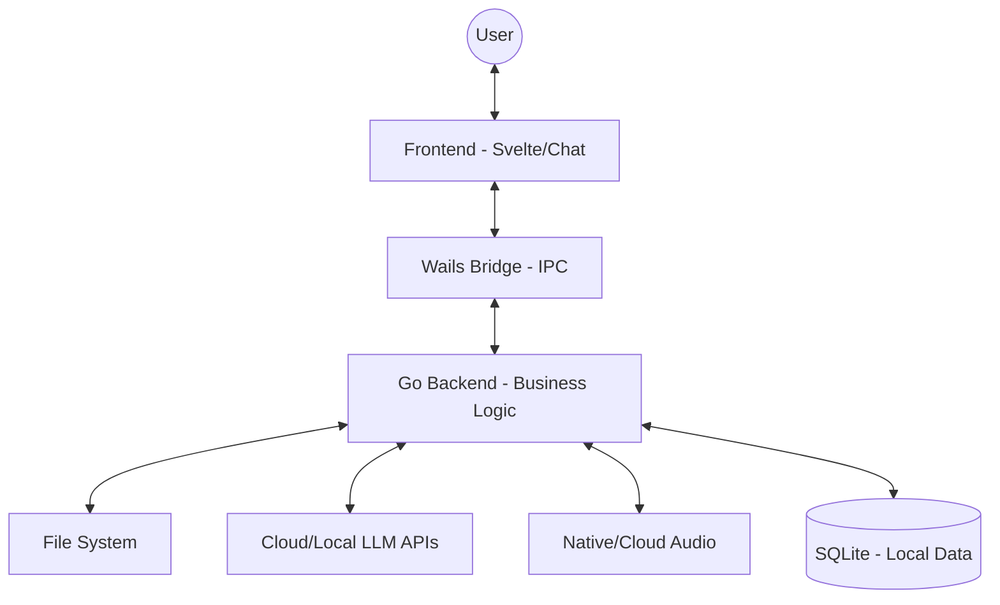

<div align="center">

# AI Agent - Multimodal Desktop Assistant
### Fast and local interface for multimodal AI productivity


<a href="https://snapcraft.io/agenteia">
  
</a>

</div>

AI Agent is a cross-platform desktop assistant compatible with all Linux distributions and Windows. Developed in Go and Wails, it integrates with various language model providers (LLMs) to provide a fast and local interface for productivity.

---

## Technologies

The project utilizes the following components:

*   **Backend:** [Go](https://golang.org/) + [Wails v2](https://wails.io/)
*   **Frontend:** [Svelte](https://svelte.dev/) + [Vite](https://vitejs.dev/)
*   **Supported Providers:**
    *   **Groq:** Llama and Mixtral models (focus on speed).
    *   **Google Gemini:** Flash and Pro models from the 1.5/2.0 series.
    *   **OpenAI:** Support for GPT-4o and legacy models.
    *   **DeepSeek:** OpenAI-compatible API.
    *   **OpenRouter:** Unified access to multiple models.
    *   **Ollama:** Support for local models via Ollama server.
*   **Audio & Voice:**
    *   Support for **OpenAI TTS** for cloud synthesis.
    *   Native integration via **Web Speech API**.
    *   Support for **spd-say** on Linux for local system voices.
*   **Persistence:** SQLite for chat history and local settings.
*   **Compatibility:**
    *   **Linux:** All distributions (Ubuntu, Fedora, Arch, Debian, etc.) via Snap, Flatpak, or native build.
    *   **Windows:** Windows 10 and 11.

---

## Architecture

The application follows a hybrid IPC (Inter-Process Communication) architecture.



---

## Configuration

To use the assistant, you need to configure your API keys:

1.  Open AI Agent.
2.  Go to the **Settings** menu (gear icon).
3.  Enter the keys for the desired providers (e.g., Gemini, Groq, OpenAI).
4.  Click **Save Settings**.

---

## Build and Compilation

### Requirements
*   Go 1.21+
*   Node.js (LTS recommended)
*   Wails CLI

Binary files and installers (Windows .exe and Linux) are already available in the repository, located in the [build/bin](./build/bin) directory.

### Generate binary for your system
To generate the files manually, use the commands below. After execution, the files will be updated in the `build/bin` directory.

```bash
# Build for Linux
wails build -platform linux/amd64

# Build for Windows
wails build -platform windows/amd64 -nsis
```

### Linux (Flatpak)
The project includes a script for automated Flatpak builds:
```bash
./build-flatpak.sh
```

### Linux (Snap)
The project is available on the Snap Store:
[](https://snapcraft.io/agenteia)

Or install via terminal:
```bash
sudo snap install agenteia
```

---

**Erasmo Cardoso**
**Software Engineer | Electronics Specialist**
