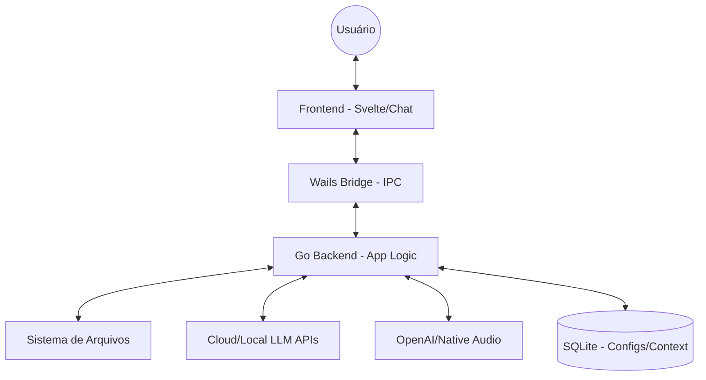

# 🤖 Agente IA - Assistente Multimodal Desktop

O Agente IA é um ecossistema de inteligência artificial poderoso e flexível, projetado para interagir diretamente com seu sistema operacional. Ele combina o poder das LLMs modernas com uma interface desktop rica e rápida.

---

## 🛠️ Tecnologias Utilizadas

Este projeto foi construído utilizando as seguintes tecnologias de ponta:

*   **Backend:** [Go (Golang)](https://golang.org/) + [Wails](https://wails.io/) (Interface nativa)
*   **Frontend:** [Svelte](https://svelte.dev/) + [Vite](https://vitejs.dev/)
*   **Inteligência Artificial (LLMs):**
    *   **Groq:** Modelos ultra-rápidos (Llama 3.3, Mixtral).
    *   **Google Gemini:** Visão e raciocínio avançado (Flash/Pro).
    *   **OpenAI:** Padrão de mercado (GPT-4o).
    *   **DeepSeek:** Raciocínio (V3/R1).
    *   **OpenRouter:** Acesso universal a centenas de modelos.
    *   **Ollama:** Suporte a modelos rodando localmente.
*   **🔓 Detravas de IA (Unlock Models):** Opção para desativar filtros restritivos das LLMs, permitindo respostas mais diretas, criativas e sem censura.
*   **Áudio & Voz:**
    *   **OpenAI TTS:** Vozes neurais de alta qualidade.
    *   **Web Speech API:** Síntese de voz nativa do sistema.
*   **Banco de Dados:** SQLite (Contextos, Histórico e Configurações).

---

## 🏗️ Engenharia e Funcionamento

O app utiliza uma arquitetura híbrida onde o Frontend (Svelte) se comunica de forma assíncrona com o Backend (Go) através do Wails Bridge.



---

## 🔑 Como configurar suas API Keys

Para liberar o poder total da IA, você precisa adicionar suas chaves:

1.  Abra o Agente IA.
2.  Clique no ícone de **⚙️ Configurações** na barra lateral.
3.  Insira as chaves dos provedores que deseja usar:
    *   **Groq:** Obtenha em [console.groq.com](https://console.groq.com/keys).
    *   **Gemini:** Obtenha no [Google AI Studio](https://aistudio.google.com/app/apikey).
    *   **OpenAI:** Obtenha no dashboard da [OpenAI](https://platform.openai.com/api-keys).
4.  Clique em **Salvar Configurações**.

---

## 🔊 Diferenças de Áudio por Sistema

O Agente IA suporta dois modos de áudio: **OpenAI Premium (Nuvem)** e **Nativo (Local)**.

*   **Windows:** O áudio nativo utiliza as vozes do Microsoft SAPI/Edge, que são muito naturais e rápidas.
*   **macOS:** Utiliza as vozes premium da Apple (como Siri e Alex), proporcionando uma experiência excelente sem delay.
*   **Linux:** O áudio nativo depende do `speech-dispatcher`. Pode soar mais robótico dependendo da distribuição instalada. **Dica:** No Linux, use o motor **OpenAI Premium** para vozes humanas perfeitas.

---

## 🚀 Como Instalar ou Gerar Build

### Requisitos
*   Go 1.21+
*   Node.js & NPM
*   Wails CLI

### Gerar Build para seu sistema
```bash
# Instalar Wails se não tiver
go install github.com/wailsapp/wails/v2/cmd/wails@latest

# Build para Linux
wails build -platform linux/amd64

# Build para Windows (requer Mingw no Linux para cross-compile)
wails build -platform windows/amd64
```

---

## 📦 Executáveis

Os executáveis compilados estão disponíveis na pasta `build/bin/`.
*   `agenteIA.exe` (Windows)
*   `agenteIA` (Linux)

---

**Erasmo Cardoso - Dev**
